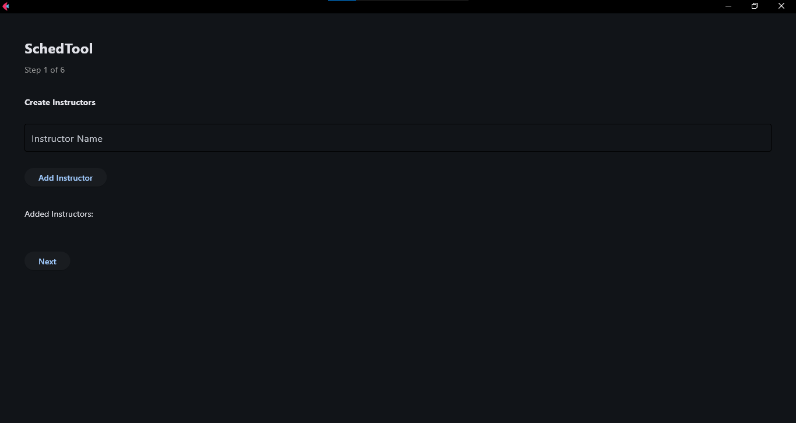

# SchedTool: Class Scheduler



SchedTool is a digital class scheduling solution that optimizes the academic scheduling process by ensuring efficient matching between rooms, instructors, subjects, and time slots. Using genetic algorithms, it creates conflict-free schedules while reducing manual effort and eliminating human errors.

To run the app:
```
flet run ui.py
```

## 🌟 Features

- **Automated Scheduling**: Fully automated process that generates optimal class schedules
- **Conflict Resolution**: Prevents double-booking of rooms and instructors
- **Resource Optimization**: Efficient allocation of classrooms and teaching resources
- **User-Friendly Interface**: Simple interface for inputting scheduling requirements
- **Genetic Algorithm**: Uses evolutionary computation to find the best possible schedules

## 🔧 Technical Requirements

- Python 3.x
- flet library
- pillow library

## ⚙️ Core Constraints

### Students
- One class at a time
- One room assignment per time slot
- One instructor per session

### Instructors
- Cannot be scheduled in multiple rooms simultaneously
- Must have availability for assigned time slots

### Rooms
- One class block per time slot
- Room type must match subject requirements (lecture/laboratory)

### Subjects
- Flexible duration support
- Multiple instructor availability
- Maximum twice-weekly scheduling
- Cannot be scheduled multiple times in one day

### Time Slots
- Available window: 7 AM to 9 PM
- Monday to Friday scheduling
- 5-10 minute intervals between subjects
- 30-60 minute breaks every 5 hours

## 🔄 Process Flow

1. **Class Input**: Users input blocks, subjects, rooms, instructors, and time slots
2. **Random Schedule Generation**: Initial schedule creation following constraints
3. **Fitness Calculation**: Evaluation of schedule optimality
4. **Parent Selection**: Selection of best schedules for evolution
5. **Parent Crossover**: Integration of parent schedules
6. **Optimized Schedule Generation**: Final schedule creation through iteration

## 💡 Benefits

- **Schedule Organizers**: Reduces manual effort and eliminates scheduling errors
- **Students**: Ensures optimal learning spaces and course preferences
- **Instructors**: Guarantees availability and prevents scheduling conflicts
- **University**: Maximizes resource utilization and streamlines operations

## 📚 Algorithm Details

SchedTool implements various genetic algorithm techniques:
- Elitism
- Dynamic Genetic Clustering Algorithm
- Multi-Parent Crossover
- Multiple Coevolution
- Social Disaster Techniques (SDT)

## 📄 License

This project is licensed under the MIT License - see the LICENSE file for details.


---
*Note: This project was developed as part of academic research at Holy Angel University.*